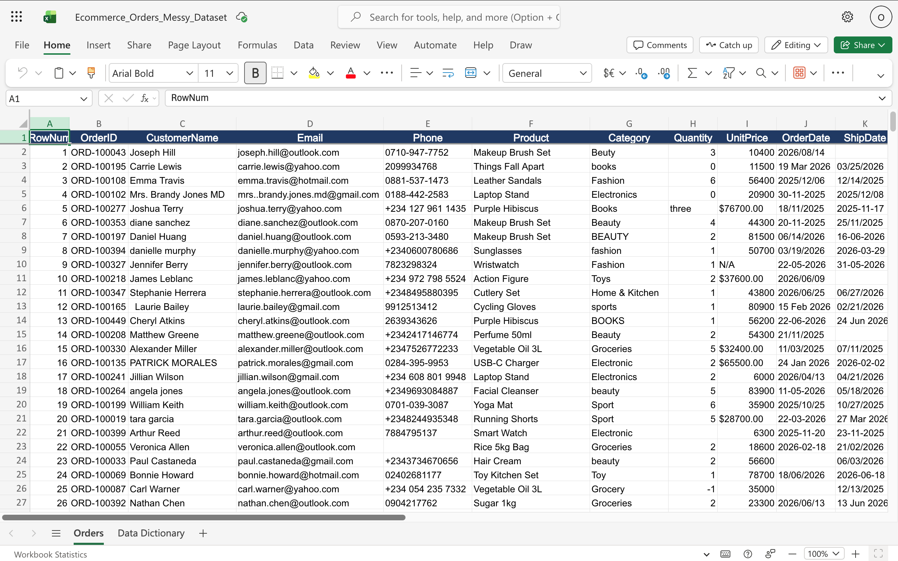
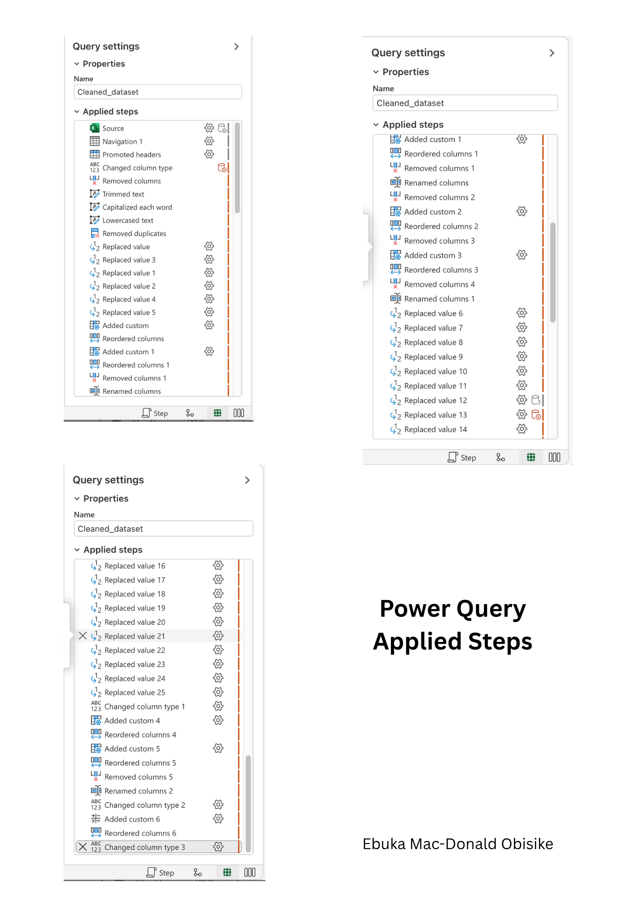
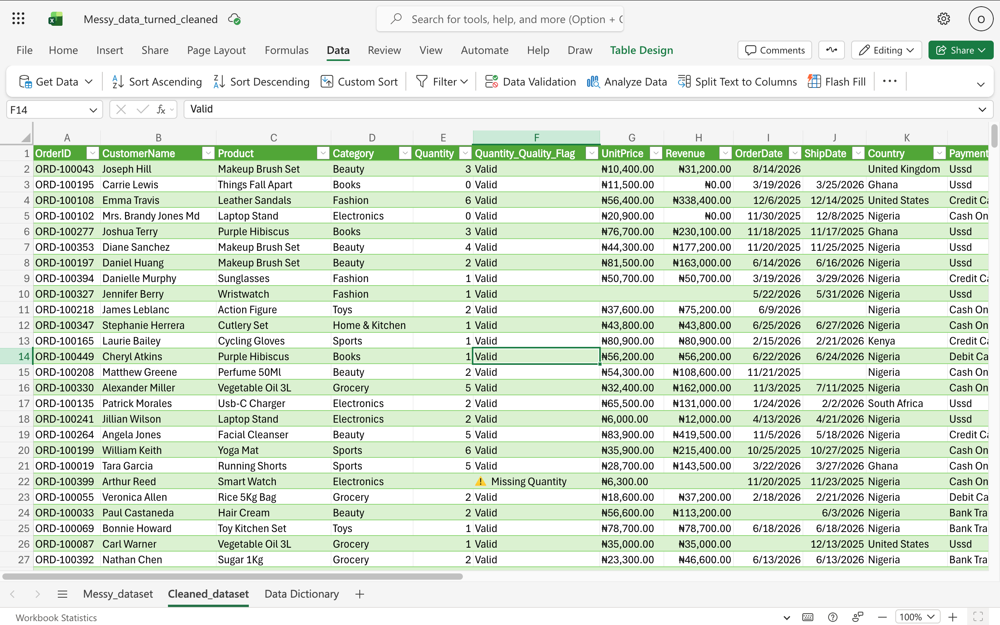

# 🧹 E-Commerce Sales Data Cleaning Project

## 📌 Project Background
This project performs an end-to-end data cleaning on a raw e-commerce sales dataset containing **299+ order records**. 

The dataset suffered from numerous data quality issues, including:
- Duplicate records
- Inconsistent formatting (mixed cases, extra spaces)
- **Human errors in free-text fields** (misspellings in Category, Country, PaymentMethod, OrderStatus)
- Negative quantity typos (e.g., delivered orders showing -3 units)
- Messy Unit Price values (mixed currencies, symbols, and negative prices)
- Mixed date formats (US vs. UK)
- Missing values (nulls) across multiple columns

These issues made the data unreliable for any downstream analysis, reporting, or dashboarding. This project systematically addresses each problem using a structured **Understand → Inspect → Clean → Validate** workflow.

---

## 🎯 Project Objective
- Transform the raw, messy dataset into a **clean, reliable, and analysis-ready** dataset.
- Document all data quality issues and the steps taken to resolve them.
- Provide **recommendations to the business** on how to prevent these errors from happening in the future (e.g., dropdown menus, mandatory fields, date pickers).

---

## 🛠️ Tools Used
| Tool | Purpose |
| :--- | :--- |
| **Power Query (Excel)** | Performed all data extraction, transformation, and loading (ETL) operations. |
| **Microsoft Excel** | Stored and presented the final cleaned dataset. |
| **Microsoft Word** | Documented the cleaning process in a detailed log book. |
| **GitHub** | Hosted the project for portfolio and version control. |

---

## 🧼 Data Cleaning Workflow Overview

I followed a structured **4-phase workflow**:

### 1. Understand (Know Your Data)
- Reviewed all 15 columns to understand their business meaning.
- Identified which columns were essential for sales analysis.
- Decided to remove `Email`, `Phone`, `Notes`, and `RowNum` to protect customer privacy and reduce clutter.

### 2. Inspect (Find the Mess)
- **Data Types**: Verified Power Query assigned the correct types (Text, Number, Date).
- **Missing Values**: Found `null` values in `Quantity`, `Unit Price`, `OrderDate`, and `ShipDate`.
- **Duplicates**: Found duplicate `OrderID`s. Recognized that `OrderID` is a **group identifier** (one order can have multiple products), not a unique row identifier. This was a critical insight.
- **Inconsistent Spellings (Human Errors)**: Found multiple variations of the same category/country/status (e.g., `beauty`, `BEAUTY`, `Beauty`; `Nigera` vs `Nigeria`; `Cod` vs `Cash On Delivery`; `Canceled` vs `Cancelled`).
- **Inconsistent Capitalization**: Found mixed case in names and categories.
- **Extra Spaces**: Found hidden leading/trailing spaces in text columns.
- **Invalid Values**: Found negative quantities for delivered orders (typos) and negative Unit Prices.
- **Date Format Issues**: Found mixed US (`MM/DD/YYYY`) and UK (`DD/MM/YYYY`) formats.

### 3. Clean (Fix the Problems)
- **Text Standardization**: Applied **Trim** (remove extra spaces) and **Capitalize Each Word** to all text columns.
- **Correcting Human Errors (Spellings)**: Manually standardized `Category`, `Country`, `PaymentMethod`, and `OrderStatus` to ensure consistency.
- **Duplicate Removal**: Removed only **exact duplicate rows** by selecting all columns except `OrderID`. This preserved multi-product orders while deleting true typing errors.
- **Quantity Fix**: Created a custom column with logic: *If status is "Returned", keep negative; else if quantity < 0, flip to positive; else leave unchanged.*
- **Unit Price Fix**: Used a custom formula to strip out `NGN`, `$`, commas, and negative signs, converting it to a clean numeric Decimal column.
- **Date Fix**: Used a custom formula to try US format first, then UK format, safely converting all readable dates to a single Date type.
- **Quality Flag**: Created a `Quantity_Quality_Flag` column to track missing (null) values without destroying the numeric data type.

### 4. Validate (Check My Work)
- Verified row count and column count.
- Confirmed categories, statuses, and countries were now consistent.
- Re-ran duplicate check to confirm all true duplicates were removed.
- Performed logical spot checks (e.g., Returned orders still show negative Quantity).

---

## 📊 Key Cleaning Steps & Business Impact

| Cleaning Category | Action Taken | Business Impact |
| :--- | :--- | :--- |
| **Text Standardization** | Trimmed spaces, unified to Proper Case | Prevents incorrect grouping in Pivot Tables |
| **Correcting Human Errors (Spellings)** | Standardized free-text entries in `Category`, `Country`, `PaymentMethod`, and `OrderStatus`. Fixed "beauty/BEAUTY" to "Beauty", "Nigera" to "Nigeria", "Cod/COD" to "Cash On Delivery", "Canceled" to "Cancelled". | **Eliminated fragmented data.** Without this, the business would think they sold products in "Nigera" and "Nigeria" (two separate countries) or had 3 different payment types when they only had 1. This ensures the sales team sees a single, unified view of their business. |
| **Duplicate Removal** | Removed only exact duplicate rows (using all columns except OrderID) | Prevents inflated sales and stock figures. Preserves multi-product orders. |
| **Quantity Fix** | Fixed negative quantities for Shipped/Delivered orders; kept negatives only for Returns | Ensures accurate total units sold and revenue. Returns correctly subtract from totals. |
| **Unit Price Fix** | Stripped out NGN, $, commas; flipped negatives to positive | Enables mathematical calculations for revenue analysis. Unlocks `Quantity * Unit Price = Revenue`. |
| **Date Standardization** | Unified and converted to standard Date type | Enables accurate time-series analysis (e.g., monthly sales trends, shipping delays). |
| **Data Quality Flag** | Created a flag column to track missing Quantity values | Provides transparency on data reliability for stakeholders. |
| **Privacy Protection** | Removed Email, Phone, and Notes columns | Protects customer data and reduces legal/compliance risk. |

---

## 📸 Visual Proof of Cleaning

Here are screenshots showing the transformation:

| Screenshot | Description |
| :--- | :--- |
|  | The raw, messy dataset before any cleaning. |
|  | Overview of the data issues identified during inspection. |
|  | Side-by-side comparison of Category standardization and Quantity fixes. |
|  | Unit Price column before (NGN, $, commas, negatives) and after (clean numeric). |
|  | Full list of applied steps in Power Query showing the complete workflow. |
|  | Final cleaned dataset ready for analysis. |

---

## 📁 Project Structure

---

## 🔍 How to View My Work

1. **Final Cleaned Data**: Open `data/processed/cleaned_e-commerce_dataset.xlsx` to see the final dataset ready for analysis.
2. **Original Raw Data**: Open `data/raw/Ecommerce_Orders_Messy_Dataset.xlsx` to compare the messy before version (not required for analysis, but kept for reference).
3. **Detailed Log Book**: Refer to `docs/Data Cleaning Log Book.pdf` for a comprehensive, step-by-step documentation of the entire cleaning process, including my thought process, challenges, and business recommendations.
4. **Summary Log Book**: For a quicker overview, check `docs/data_cleaning_logbook_Summary.pdf`.
5. **Screenshots**: Browse the `images/` folder for visual evidence of the transformation.

---

## 📌 Business Recommendations

Based on the issues found during cleaning, I recommend the following system changes to prevent future data entry errors:

| Issue | Recommendation |
| :--- | :--- |
| Inconsistent spellings in Category, Country, PaymentMethod | Implement **dropdown menus** in the data entry system to enforce consistency. |
| Missing Quantity, Unit Price, OrderDate | Enforce **mandatory fields** so the system cannot save incomplete records. |
| Mixed date formats (US vs UK) | Use a **date picker (calendar widget)** to ensure dates are saved in a single, unified format. |
| Negative quantity typos | Add **validation rules** to prevent negative quantities unless explicitly marked as "Returned". |

---

## 💼 About Me

[Ebuka Mac-Donald Obisike] | Data Analyst  
[https://www.linkedin.com/in/ebuka-obisike-4aa14531b/?trk=public-profile-join-page] | [ebukaobisike@outlook.com]

---

## 🏷️ Tags

`#DataCleaning` `#PowerQuery` `#Excel` `#ECommerce` `#DataQuality` `#Portfolio`

---

### 📌 Pin This Repository

If you find this project useful, feel free to star ⭐ it on GitHub!

