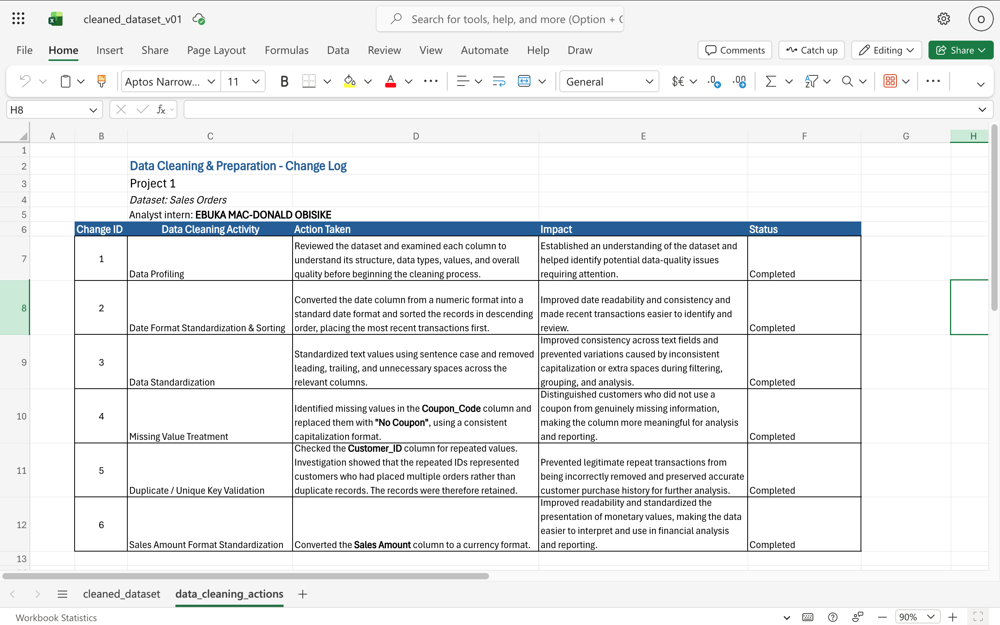
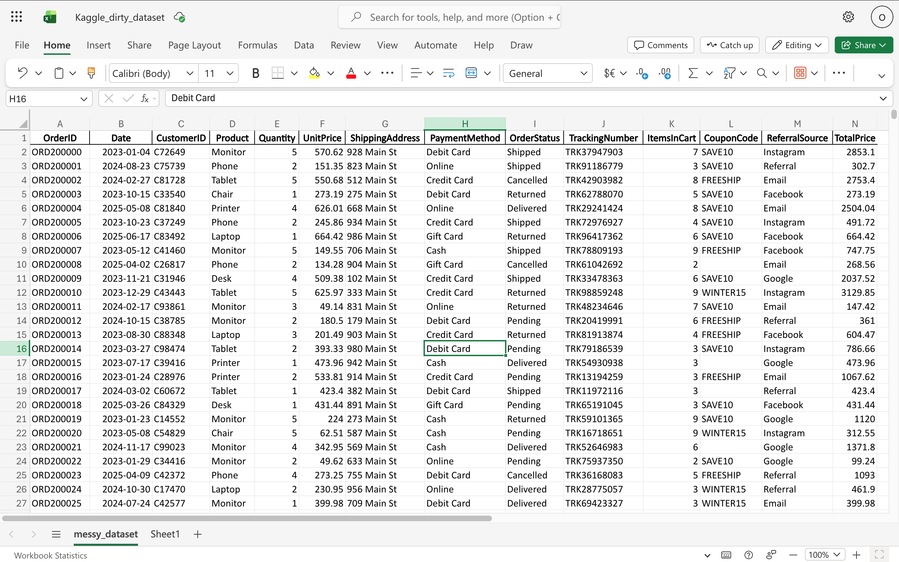
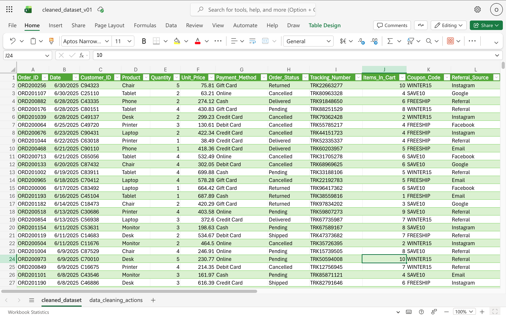

# 🧹 Data Cleaning Project: Sales Orders Dataset

**Objective:** To thoroughly clean and prepare a messy sales orders dataset sourced from Kaggle using Microsoft Excel's Power Query, transforming it from raw, unusable data into a clean, analysis-ready format.

---

## 📂 Project Structure

- **Raw Data:** `raw-data/Kaggle_messy_dataset.xlsx` - Unprocessed data with inconsistencies (source: Kaggle).
- **Cleaned Data:** `cleaned-data/cleaned_dataset_v01.xlsx` - Final output ready for analysis.
- **Process:** Full transformation performed using Power Query, documented in a detailed change log.

---

## 🛠️ Tools Used

- **Microsoft Excel** (Power Query)
- **GitHub** (Portfolio Hosting)

---

## 📋 The Cleaning Process: Complete Change Log

Below is the full logbook of data cleaning activities performed on the dataset. Each step includes the action taken and the specific business impact of that change.

| ID | Data Cleaning Activity | Action Taken | Impact | Status |
| :--- | :--- | :--- | :--- | :--- |
| 1 | **Data Profiling** | Reviewed the dataset and examined each column to understand its structure, data types, values, and overall quality before beginning the cleaning process. | Established an understanding of the dataset and helped identify potential data-quality issues requiring attention. | Completed |
| 2 | **Date Format Standardization & Sorting** | Converted the date column from a numeric format into a standard date format and sorted the records in descending order, placing the most recent transactions first. | Improved date readability and consistency and made recent transactions easier to identify and review. | Completed |
| 3 | **Data Standardization** | Standardized text values using sentence case and removed leading, trailing, and unnecessary spaces across the relevant columns. | Improved consistency across text fields and prevented variations caused by inconsistent capitalization or extra spaces during filtering, grouping, and analysis. | Completed |
| 4 | **Missing Value Treatment** | Identified missing values in the `Coupon_Code` column and replaced them with "No Coupon", using a consistent capitalization format. | Distinguished customers who did not use a coupon from genuinely missing information, making the column more meaningful for analysis and reporting. | Completed |
| 5 | **Duplicate / Unique Key Validation** | Checked the `Customer_ID` column for repeated values. Investigation showed that the repeated IDs represented customers who had placed multiple orders rather than duplicate records. The records were therefore retained. | Prevented legitimate repeat transactions from being incorrectly removed and preserved accurate customer purchase history for further analysis. | Completed |
| 6 | **Sales Amount Format Standardization** | Converted the `Sales Amount` column to a currency format. | Improved readability and standardized the presentation of monetary values, making the data easier to interpret and use in financial analysis and reporting. | Completed |

---

## 🖼️ Visual Proof: Power Query Applied Steps

Here is a screenshot of the **"Applied Steps"** pane from my Power Query Editor, showing the entire transformation sequence. It matches the logbook above step-by-step.

---

## 📊 Before vs. After

**Before (Raw, Messy Data):**  
*Shows the original data with inconsistent dates, missing coupon codes, and unformatted sales amounts.*

**After (Cleaned, Structured Data):**  
*Shows the polished table with proper date formatting, standardized text, coupon handling, and currency formatting.*

---

## 🎯 Key Takeaway

This project demonstrates my ability to use **Power Query** to automate the data cleaning process. Instead of manually fixing thousands of rows, I built a repeatable workflow that can handle new data with just a click of the "Refresh" button. 

Most importantly, I documented the **business reasoning** behind each cleaning step—ensuring that the data isn't just "clean," but actually **meaningful** for downstream analysis.

---

## 📌 Next Steps

This cleaned dataset is now ready for further analysis, such as:
- Exploratory Data Analysis (EDA)
- Sales performance reporting
- Customer segmentation

---

**Date Completed:** August 2026

**Analyst:** Ebuka Mac-Donald Obiskie
